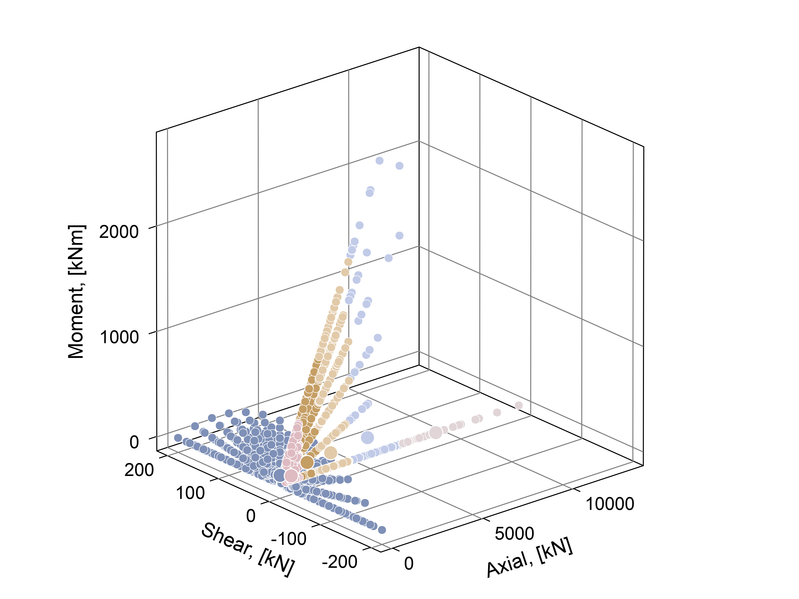
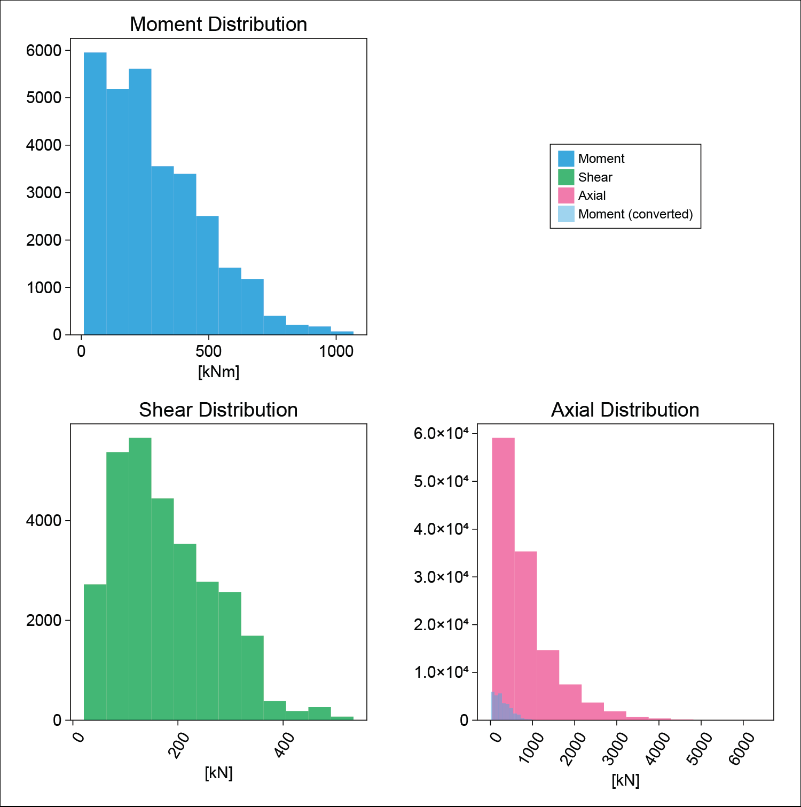
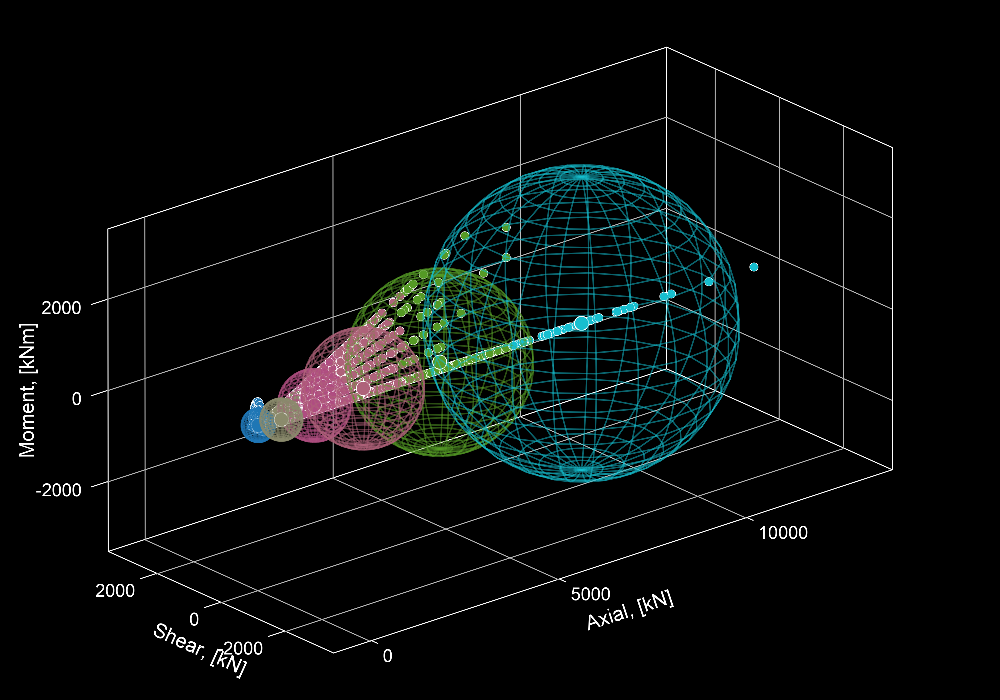

# kjlMakie

Makie theme for light/dark mode, as well as some commonly used utility functions. Mostly tested/intended for 2D vector plotting (`CairoMakie`) in half-width journal formatting (ie text sizes are sized to be legible in half-width format). Will most likely not work with the `WGLMakie` backend.

The two available themes are `kjl_light` and `kjl_dark`.

Background colours are all set to transparent to allow for placement in non-white/non-black scenarios. `GLMakie` requires a non-transparent background colour for the figure to render properly. Make sure to use `Figure(backgroundcolor = :color)` if working in `GLMakie`.

# Examples using kjlMakie

